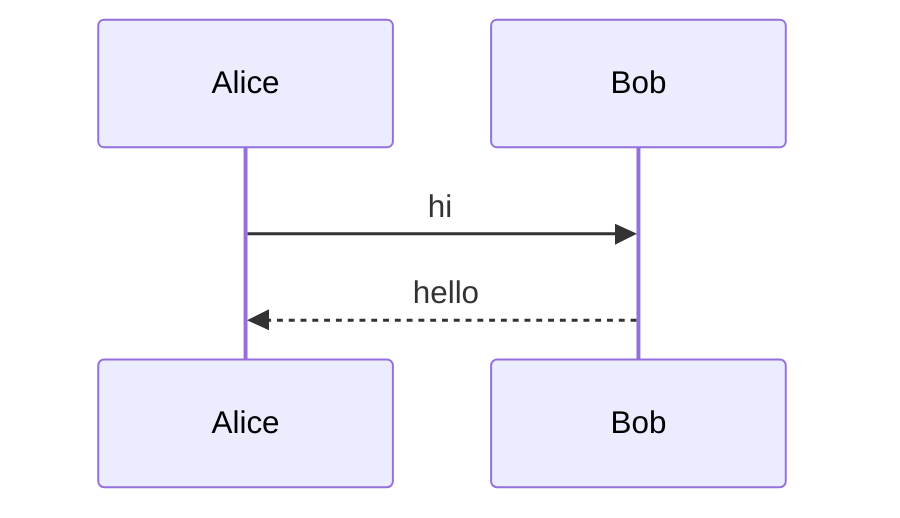
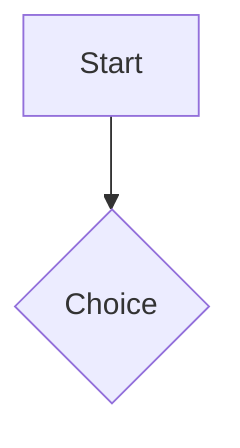

# Mermaid M1 — Main Package Infrastructure Implementation Plan

> **For agentic workers:** REQUIRED SUB-SKILL: Use superpowers:subagent-driven-development (recommended) or superpowers:executing-plans to implement this plan task-by-task. Steps use checkbox (`- [ ]`) syntax for tracking.

**Goal:** Land all main-package infrastructure for Mermaid rendering — interface, data types, cache, options, widgets, and `ContentBuilder` routing — without bundling any concrete renderer (deferred to M2 subpackage).

**Architecture:** Main package defines a `MermaidRenderer` interface. Public widgets (`MermaidView` with full state machine, `MermaidArtifactView`, `MermaidFullscreenViewer`) operate against this interface. Default behavior with `MermaidOptions == null`: existing `CodeBlockView` path, zero behavior change. With renderer configured: streaming-safe state machine routes through cache → render future → SVG display, falling back to `CodeBlockView` + banner on every failure mode.

**Tech Stack:** Dart, Flutter, `package:markdown` (existing), `flutter_svg` (new dep), `flutter_test`, `meta` (for `@experimental`).

**Spec:** [`docs/superpowers/specs/2026-05-06-mermaid-design.md`](../specs/2026-05-06-mermaid-design.md)

**Out of scope (future plans):**
- M2: `flutter_markdown_widget_mermaid` subpackage with `FlutterJsMermaidRenderer`
- M3: Example app showcase + README documentation

---

## File map

### Created

| Path | Responsibility |
|---|---|
| `lib/src/core/mermaid/mermaid_theme.dart` | `MermaidTheme` enum |
| `lib/src/core/mermaid/mermaid_artifact.dart` | `MermaidArtifact` data type |
| `lib/src/core/mermaid/mermaid_error.dart` | Sealed `MermaidError` hierarchy + `MermaidErrorContext` |
| `lib/src/core/mermaid/mermaid_renderer.dart` | Abstract `MermaidRenderer` interface |
| `lib/src/core/mermaid/mermaid_cache.dart` | LRU cache keyed by `{contentHash}:{theme}:{rendererVersion}` |
| `lib/src/core/mermaid/mermaid_options.dart` | Public `MermaidOptions` config |
| `lib/src/widgets/components/mermaid_artifact_view.dart` | Renders a resolved `MermaidArtifact` (SVG + sizing) |
| `lib/src/widgets/components/mermaid_fullscreen_viewer.dart` | Tap-to-fullscreen pan/zoom dialog |
| `lib/src/widgets/components/mermaid_view.dart` | Stateful state-machine widget orchestrating the full lifecycle |
| `lib/src/testing/fake_mermaid_renderer.dart` | Test double exported for host apps |
| `lib/testing.dart` | Public testing barrel (re-exports `FakeMermaidRenderer` + `MermaidRenderCall`) |
| `test/mermaid/mermaid_theme_test.dart` | Theme enum tests |
| `test/mermaid/mermaid_artifact_test.dart` | Artifact construction + viewBox parse tests |
| `test/mermaid/mermaid_error_test.dart` | Error hierarchy tests |
| `test/mermaid/fake_mermaid_renderer_test.dart` | Fake renderer behavior tests |
| `test/mermaid/mermaid_cache_test.dart` | LRU + key composition tests |
| `test/mermaid/mermaid_options_test.dart` | Options equality + copyWith tests |
| `test/mermaid/mermaid_artifact_view_test.dart` | Widget tests for SVG view + sizing |
| `test/mermaid/mermaid_fullscreen_viewer_test.dart` | Fullscreen viewer widget tests |
| `test/mermaid/mermaid_view_core_test.dart` | State machine A1–A6, A12 |
| `test/mermaid/mermaid_view_advanced_test.dart` | State machine A7–A11 |
| `test/mermaid/content_builder_routing_test.dart` | `language == 'mermaid'` routing |
| `test/mermaid/cross_parser_consistency_test.dart` | AST + Incremental parsers produce same `language`/`contentHash` |

### Modified

| Path | Change |
|---|---|
| `pubspec.yaml` | Add `flutter_svg: ^2.0.10+1` dep |
| `lib/src/config/render_options.dart` | Add `mermaidOptions` field + plumb through `copyWith`/`==`/`hashCode` |
| `lib/src/builder/content_builder.dart` | `_buildCodeBlock` checks `block.language == 'mermaid'` and routes to `MermaidView` when renderer is configured |
| `lib/flutter_markdown_widget.dart` | Export public Mermaid types |

---

## Task ordering rationale

Bottom-up dependency order:

1. **Tasks 1–5**: Atomic data + interface types. No dependencies between them (except 4 referencing types from 3).
2. **Task 6**: `FakeMermaidRenderer` becomes the testing fixture used by ALL widget tests downstream.
3. **Tasks 7–9**: Cache + options + integration with existing `RenderOptions`.
4. **Tasks 10–11**: Pure-display leaf widgets, testable in isolation with synthetic artifacts.
5. **Tasks 12–13**: `MermaidView` state machine — the biggest unit, split by complexity.
6. **Task 14**: `ContentBuilder` routing — wires everything together.
7. **Task 15**: Cross-parser consistency — the explicit lesson learned from Block ID plan.
8. **Task 16**: Public exports + final verification gate.

Each task ends with one commit. The plan produces 16 commits.

---

### Task 1: Add `flutter_svg` dependency

**Files:**
- Modify: `pubspec.yaml`

**Step 1: Add dependency**

- [ ] Open `pubspec.yaml` and add `flutter_svg: ^2.0.10+1` under `dependencies` (after `flutter_math_fork`):

```yaml
dependencies:
  flutter:
    sdk: flutter
  # Markdown parsing
  markdown: ^7.3.0
  # Path utilities
  path: ^1.9.1
  # Meta annotations
  meta: ^1.16.0
  # LaTeX rendering
  flutter_math_fork: ^0.7.3
  # SVG rendering (used by MermaidArtifactView)
  flutter_svg: ^2.0.10+1
  # Scroll to index support for TOC navigation
  scrollable_positioned_list: ^0.3.8
```

**Step 2: Resolve dependencies**

- [ ] Run:

```bash
flutter pub get
```

Expected: success, `pubspec.lock` updated.

**Step 3: Verify**

- [ ] Run existing test suite to confirm no regression:

```bash
flutter test
```

Expected: PASS (no test changes yet).

**Step 4: Commit**

- [ ] Commit:

```bash
git add pubspec.yaml pubspec.lock
git commit -m "build: add flutter_svg dep for Mermaid M1"
```

---

### Task 2: `MermaidTheme` enum

**Files:**
- Create: `lib/src/core/mermaid/mermaid_theme.dart`
- Test: `test/mermaid/mermaid_theme_test.dart`

**Step 1: Write failing test**

- [ ] Create `test/mermaid/mermaid_theme_test.dart`:

```dart
// Copyright 2026 The Flutter Markdown Widget Authors. All rights reserved.
// Use of this source code is governed by a BSD-style license that can be
// found in the LICENSE file.

import 'package:flutter/material.dart';
import 'package:flutter_markdown_widget/src/core/mermaid/mermaid_theme.dart';
import 'package:flutter_test/flutter_test.dart';

void main() {
  group('MermaidTheme', () {
    test('exposes all five canonical values', () {
      expect(MermaidTheme.values, hasLength(5));
      expect(
        MermaidTheme.values,
        containsAll([
          MermaidTheme.auto,
          MermaidTheme.light,
          MermaidTheme.dark,
          MermaidTheme.neutral,
          MermaidTheme.forest,
        ]),
      );
    });

    test('resolveAuto returns dark for Brightness.dark', () {
      expect(MermaidTheme.auto.resolveAuto(Brightness.dark), MermaidTheme.dark);
    });

    test('resolveAuto returns light for Brightness.light', () {
      expect(
        MermaidTheme.auto.resolveAuto(Brightness.light),
        MermaidTheme.light,
      );
    });

    test('resolveAuto returns self for non-auto themes', () {
      expect(
        MermaidTheme.forest.resolveAuto(Brightness.light),
        MermaidTheme.forest,
      );
      expect(
        MermaidTheme.neutral.resolveAuto(Brightness.dark),
        MermaidTheme.neutral,
      );
    });
  });
}
```

**Step 2: Run test to verify failure**

- [ ] Run:

```bash
flutter test test/mermaid/mermaid_theme_test.dart
```

Expected: FAIL with import error (file does not exist).

**Step 3: Create the enum**

- [ ] Create `lib/src/core/mermaid/mermaid_theme.dart`:

```dart
// Copyright 2026 The Flutter Markdown Widget Authors. All rights reserved.
// Use of this source code is governed by a BSD-style license that can be
// found in the LICENSE file.

import 'package:flutter/material.dart';

/// Visual theme requested for a Mermaid diagram.
///
/// `auto` resolves to `light` or `dark` based on the ambient
/// `Theme.of(context).brightness`. The other values are passed through to
/// the underlying renderer.
enum MermaidTheme {
  /// Track the ambient `Brightness` (default).
  auto,

  /// Light background, dark foreground.
  light,

  /// Dark background, light foreground.
  dark,

  /// Mermaid's neutral palette.
  neutral,

  /// Mermaid's forest palette.
  forest;

  /// Resolves [auto] to a concrete theme based on ambient brightness.
  ///
  /// Non-auto values return themselves unchanged.
  MermaidTheme resolveAuto(Brightness brightness) {
    if (this != MermaidTheme.auto) return this;
    return brightness == Brightness.dark
        ? MermaidTheme.dark
        : MermaidTheme.light;
  }
}
```

**Step 4: Run test to verify pass**

- [ ] Run:

```bash
flutter test test/mermaid/mermaid_theme_test.dart
```

Expected: PASS, 4 tests.

**Step 5: Commit**

- [ ] Commit:

```bash
git add lib/src/core/mermaid/mermaid_theme.dart test/mermaid/mermaid_theme_test.dart
git commit -m "feat(mermaid): add MermaidTheme enum with auto resolution"
```

---

### Task 3: `MermaidArtifact` data class

**Files:**
- Create: `lib/src/core/mermaid/mermaid_artifact.dart`
- Test: `test/mermaid/mermaid_artifact_test.dart`

**Step 1: Write failing test**

- [ ] Create `test/mermaid/mermaid_artifact_test.dart`:

```dart
// Copyright 2026 The Flutter Markdown Widget Authors. All rights reserved.
// Use of this source code is governed by a BSD-style license that can be
// found in the LICENSE file.

import 'package:flutter/material.dart';
import 'package:flutter_markdown_widget/src/core/mermaid/mermaid_artifact.dart';
import 'package:flutter_test/flutter_test.dart';

void main() {
  group('MermaidArtifact', () {
    test('stores svg and intrinsicSize', () {
      const svg = '<svg viewBox="0 0 100 50"></svg>';
      final artifact = MermaidArtifact(
        svg: svg,
        intrinsicSize: const Size(100, 50),
      );
      expect(artifact.svg, svg);
      expect(artifact.intrinsicSize, const Size(100, 50));
    });

    test('intrinsicSize is optional', () {
      final artifact = MermaidArtifact(svg: '<svg></svg>');
      expect(artifact.intrinsicSize, isNull);
    });

    test('parseViewBox extracts width and height', () {
      const svg = '<svg viewBox="0 0 800 400" width="100"></svg>';
      expect(MermaidArtifact.parseViewBox(svg), const Size(800, 400));
    });

    test('parseViewBox tolerates whitespace and decimal values', () {
      const svg = '<svg  viewBox="  0   0   123.5   45.25  "></svg>';
      expect(MermaidArtifact.parseViewBox(svg), const Size(123.5, 45.25));
    });

    test('parseViewBox returns null when viewBox is missing', () {
      expect(MermaidArtifact.parseViewBox('<svg></svg>'), isNull);
    });

    test('parseViewBox returns null on malformed values', () {
      expect(
        MermaidArtifact.parseViewBox('<svg viewBox="0 0 abc def"></svg>'),
        isNull,
      );
    });

    test('parseViewBox returns null when value count is wrong', () {
      expect(
        MermaidArtifact.parseViewBox('<svg viewBox="0 0 100"></svg>'),
        isNull,
      );
    });

    test('equality is based on svg and intrinsicSize', () {
      final a = MermaidArtifact(svg: '<svg/>', intrinsicSize: const Size(1, 2));
      final b = MermaidArtifact(svg: '<svg/>', intrinsicSize: const Size(1, 2));
      final c = MermaidArtifact(
        svg: '<svg/>',
        intrinsicSize: const Size(2, 1),
      );
      expect(a, equals(b));
      expect(a.hashCode, equals(b.hashCode));
      expect(a, isNot(equals(c)));
    });
  });
}
```

**Step 2: Run test to verify failure**

- [ ] Run:

```bash
flutter test test/mermaid/mermaid_artifact_test.dart
```

Expected: FAIL (file does not exist).

**Step 3: Create the data class**

- [ ] Create `lib/src/core/mermaid/mermaid_artifact.dart`:

```dart
// Copyright 2026 The Flutter Markdown Widget Authors. All rights reserved.
// Use of this source code is governed by a BSD-style license that can be
// found in the LICENSE file.

import 'package:flutter/foundation.dart';
import 'package:flutter/painting.dart';

/// Output of a successful Mermaid render.
@immutable
class MermaidArtifact {
  /// Creates an artifact with raw SVG payload and an optional intrinsic size
  /// (typically parsed from `<svg viewBox>` by the renderer).
  const MermaidArtifact({required this.svg, this.intrinsicSize});

  /// Raw SVG XML. Consumers should pass to `flutter_svg`'s `SvgPicture.string`.
  final String svg;

  /// Intrinsic width/height parsed from the SVG `viewBox`, when available.
  ///
  /// Used by [MermaidArtifactView] to compute aspect-ratio-correct heights
  /// and by [BlockDimensionEstimator] for stable layouts on cache hits.
  final Size? intrinsicSize;

  /// Parses `<svg ... viewBox="x y w h" ...>` and returns `Size(w, h)`.
  ///
  /// Returns null when:
  /// - the SVG has no `viewBox` attribute
  /// - the value cannot be split into 4 numeric tokens
  /// - any of the tokens fail `double.tryParse`
  static Size? parseViewBox(String svg) {
    final match = _viewBoxPattern.firstMatch(svg);
    if (match == null) return null;
    final tokens = match
        .group(1)!
        .trim()
        .split(_whitespacePattern)
        .where((s) => s.isNotEmpty)
        .toList();
    if (tokens.length != 4) return null;
    final w = double.tryParse(tokens[2]);
    final h = double.tryParse(tokens[3]);
    if (w == null || h == null) return null;
    return Size(w, h);
  }

  static final RegExp _viewBoxPattern = RegExp(
    r'viewBox\s*=\s*"([^"]*)"',
    caseSensitive: false,
  );
  static final RegExp _whitespacePattern = RegExp(r'\s+');

  @override
  bool operator ==(Object other) =>
      identical(this, other) ||
      other is MermaidArtifact &&
          svg == other.svg &&
          intrinsicSize == other.intrinsicSize;

  @override
  int get hashCode => Object.hash(svg, intrinsicSize);
}
```

**Step 4: Run test to verify pass**

- [ ] Run:

```bash
flutter test test/mermaid/mermaid_artifact_test.dart
```

Expected: PASS, 8 tests.

**Step 5: Commit**

- [ ] Commit:

```bash
git add lib/src/core/mermaid/mermaid_artifact.dart test/mermaid/mermaid_artifact_test.dart
git commit -m "feat(mermaid): add MermaidArtifact with viewBox parsing"
```

---

### Task 4: `MermaidError` sealed hierarchy + `MermaidErrorContext`

**Files:**
- Create: `lib/src/core/mermaid/mermaid_error.dart`
- Test: `test/mermaid/mermaid_error_test.dart`

**Step 1: Write failing test**

- [ ] Create `test/mermaid/mermaid_error_test.dart`:

```dart
// Copyright 2026 The Flutter Markdown Widget Authors. All rights reserved.
// Use of this source code is governed by a BSD-style license that can be
// found in the LICENSE file.

import 'package:flutter_markdown_widget/src/core/mermaid/mermaid_error.dart';
import 'package:flutter_test/flutter_test.dart';

void main() {
  group('MermaidError subclasses', () {
    test('MermaidSyntaxError carries source and message', () {
      final err = MermaidSyntaxError(
        source: 'graph LR\n bad',
        message: 'Parse error on line 2',
        stackTrace: StackTrace.current,
      );
      expect(err.source, 'graph LR\n bad');
      expect(err.message, 'Parse error on line 2');
      expect(err, isA<MermaidError>());
    });

    test('MermaidTimeoutError carries elapsed', () {
      final err = MermaidTimeoutError(
        source: 'graph LR',
        elapsed: const Duration(seconds: 5),
        stackTrace: StackTrace.current,
      );
      expect(err.elapsed, const Duration(seconds: 5));
      expect(err, isA<MermaidError>());
    });

    test('MermaidRuntimeError carries cause', () {
      final cause = StateError('engine crash');
      final err = MermaidRuntimeError(
        source: 'graph LR',
        cause: cause,
        stackTrace: StackTrace.current,
      );
      expect(err.cause, cause);
      expect(err, isA<MermaidError>());
    });

    test('MermaidInvalidOutputError carries svg', () {
      final err = MermaidInvalidOutputError(
        source: 'graph LR',
        svg: '<not-svg/>',
        stackTrace: StackTrace.current,
      );
      expect(err.svg, '<not-svg/>');
      expect(err, isA<MermaidError>());
    });

    test('MermaidInitializationError carries cause', () {
      final cause = Exception('asset missing');
      final err = MermaidInitializationError(
        source: 'graph LR',
        cause: cause,
        stackTrace: StackTrace.current,
      );
      expect(err.cause, cause);
      expect(err, isA<MermaidError>());
    });
  });

  group('MermaidErrorContext', () {
    test('exposes error, source, and a retry callback', () {
      final err = MermaidSyntaxError(
        source: 'graph LR',
        message: 'Bad node',
        stackTrace: StackTrace.current,
      );
      var retryCalls = 0;
      final ctx = MermaidErrorContext(
        error: err,
        source: 'graph LR',
        retry: () => retryCalls++,
      );
      expect(ctx.error, err);
      expect(ctx.source, 'graph LR');
      ctx.retry();
      expect(retryCalls, 1);
    });
  });
}
```

**Step 2: Run test to verify failure**

- [ ] Run:

```bash
flutter test test/mermaid/mermaid_error_test.dart
```

Expected: FAIL.

**Step 3: Create the hierarchy**

- [ ] Create `lib/src/core/mermaid/mermaid_error.dart`:

```dart
// Copyright 2026 The Flutter Markdown Widget Authors. All rights reserved.
// Use of this source code is governed by a BSD-style license that can be
// found in the LICENSE file.

import 'package:flutter/foundation.dart';

/// Base class for all Mermaid render failures.
///
/// Sealed: subclasses cover every documented failure mode (see spec §5.1).
sealed class MermaidError {
  const MermaidError({required this.source, required this.stackTrace});

  /// The Mermaid source that failed to render.
  final String source;

  /// Stack trace at the point of failure, for diagnostic uploads.
  final StackTrace stackTrace;
}

/// `mermaid.js` reported a parse / syntax error.
class MermaidSyntaxError extends MermaidError {
  const MermaidSyntaxError({
    required super.source,
    required this.message,
    required super.stackTrace,
  });

  /// Human-readable message returned by the renderer.
  final String message;
}

/// The render future did not complete within `MermaidOptions.renderTimeout`.
class MermaidTimeoutError extends MermaidError {
  const MermaidTimeoutError({
    required super.source,
    required this.elapsed,
    required super.stackTrace,
  });

  /// Duration after which the timeout fired.
  final Duration elapsed;
}

/// Renderer threw a non-business exception (e.g., engine crash).
class MermaidRuntimeError extends MermaidError {
  const MermaidRuntimeError({
    required super.source,
    required this.cause,
    required super.stackTrace,
  });

  /// Underlying exception thrown by the renderer.
  final Object cause;
}

/// Renderer returned an SVG payload that could not be parsed/displayed.
class MermaidInvalidOutputError extends MermaidError {
  const MermaidInvalidOutputError({
    required super.source,
    required this.svg,
    required super.stackTrace,
  });

  /// The offending SVG string (for diagnostics).
  final String svg;
}

/// Renderer initialization failed permanently (e.g., asset missing,
/// engine could not start).
class MermaidInitializationError extends MermaidError {
  const MermaidInitializationError({
    required super.source,
    required this.cause,
    required super.stackTrace,
  });

  /// Underlying initialization failure.
  final Object cause;
}

/// Context passed to a user-supplied error builder.
@immutable
class MermaidErrorContext {
  const MermaidErrorContext({
    required this.error,
    required this.source,
    required this.retry,
  });

  /// The error that triggered the fallback rendering.
  final MermaidError error;

  /// The original Mermaid source.
  final String source;

  /// Invoke to attempt the render again.
  final VoidCallback retry;
}
```

**Step 4: Run test to verify pass**

- [ ] Run:

```bash
flutter test test/mermaid/mermaid_error_test.dart
```

Expected: PASS, 6 tests.

**Step 5: Commit**

- [ ] Commit:

```bash
git add lib/src/core/mermaid/mermaid_error.dart test/mermaid/mermaid_error_test.dart
git commit -m "feat(mermaid): add sealed MermaidError hierarchy"
```

---

### Task 5: `MermaidRenderer` abstract interface

**Files:**
- Create: `lib/src/core/mermaid/mermaid_renderer.dart`

**Step 1: Create the interface**

This task has no behavioral test of its own — the interface is exercised by `FakeMermaidRenderer` tests (Task 6) and `MermaidView` tests (Tasks 12–13). What we verify here is only that the file compiles and exports the expected symbols.

- [ ] Create `lib/src/core/mermaid/mermaid_renderer.dart`:

```dart
// Copyright 2026 The Flutter Markdown Widget Authors. All rights reserved.
// Use of this source code is governed by a BSD-style license that can be
// found in the LICENSE file.

import 'package:meta/meta.dart';

import 'mermaid_artifact.dart';
import 'mermaid_theme.dart';

/// Renders Mermaid source into an SVG artifact.
///
/// Implementations must be deterministic: the same `(source, theme, version)`
/// triple must always produce equivalent SVG output, so [MermaidCache] entries
/// stay valid for the lifetime of [version].
@experimental
abstract class MermaidRenderer {
  /// Renders [source] under [theme]. Implementations should:
  /// - throw [MermaidSyntaxError] for `mermaid.js` parse errors
  /// - throw [MermaidInitializationError] when the engine could not be
  ///   prepared (sync or async; both must be caught by callers)
  /// - allow the caller to apply a timeout via `Future.timeout`
  Future<MermaidArtifact> render(
    String source, {
    required MermaidTheme theme,
  });

  /// Whether the renderer is ready to serve requests.
  ///
  /// Pending initialization → `false`.
  /// Permanent init failure → stays `false` and `render()` throws synchronously.
  /// Successful initialization → `true`.
  bool get isReady;

  /// Stable identifier for the renderer + underlying mermaid.js version.
  ///
  /// Forms part of the cache key (see [MermaidCache]). Subpackages declare
  /// strings like `"flutter-js-1.0.0+mermaid-10.6.0"`. Bumping the underlying
  /// `mermaid.js` invalidates all cached entries on next access.
  String get version;

  /// Releases any held resources. Subsequent [render] calls must throw
  /// [MermaidInitializationError].
  Future<void> dispose();
}
```

**Step 2: Confirm compilation**

- [ ] Run:

```bash
flutter analyze lib/src/core/mermaid/mermaid_renderer.dart
```

Expected: 0 errors.

**Step 3: Commit**

- [ ] Commit:

```bash
git add lib/src/core/mermaid/mermaid_renderer.dart
git commit -m "feat(mermaid): add MermaidRenderer abstract interface"
```

---

### Task 6: `FakeMermaidRenderer` + `testing.dart` barrel

**Files:**
- Create: `lib/src/testing/fake_mermaid_renderer.dart`
- Create: `lib/testing.dart`
- Test: `test/mermaid/fake_mermaid_renderer_test.dart`

**Step 1: Write failing tests**

- [ ] Create `test/mermaid/fake_mermaid_renderer_test.dart`:

```dart
// Copyright 2026 The Flutter Markdown Widget Authors. All rights reserved.
// Use of this source code is governed by a BSD-style license that can be
// found in the LICENSE file.

import 'package:flutter/painting.dart';
import 'package:flutter_markdown_widget/src/core/mermaid/mermaid_error.dart';
import 'package:flutter_markdown_widget/src/core/mermaid/mermaid_theme.dart';
import 'package:flutter_markdown_widget/src/testing/fake_mermaid_renderer.dart';
import 'package:flutter_test/flutter_test.dart';

void main() {
  group('FakeMermaidRenderer', () {
    test('returns a default artifact and records calls', () async {
      final fake = FakeMermaidRenderer();
      final artifact = await fake.render(
        'graph LR\nA-->B',
        theme: MermaidTheme.light,
      );
      expect(artifact.svg, contains('<svg'));
      expect(artifact.intrinsicSize, const Size(800, 400));
      expect(fake.calls, hasLength(1));
      expect(fake.calls.single.source, 'graph LR\nA-->B');
      expect(fake.calls.single.theme, MermaidTheme.light);
    });

    test('honors svgBuilder override', () async {
      final fake = FakeMermaidRenderer()
        ..svgBuilder = (src) => '<svg data-src="$src"></svg>';
      final artifact = await fake.render('foo', theme: MermaidTheme.dark);
      expect(artifact.svg, '<svg data-src="foo"></svg>');
    });

    test('throws errorToThrow synchronously when set', () async {
      final fake = FakeMermaidRenderer()
        ..errorToThrow = MermaidSyntaxError(
          source: 'x',
          message: 'fake fail',
          stackTrace: StackTrace.current,
        );
      await expectLater(
        () => fake.render('x', theme: MermaidTheme.light),
        throwsA(isA<MermaidSyntaxError>()),
      );
    });

    test('respects latency before resolving', () async {
      final fake = FakeMermaidRenderer()..latency = const Duration(milliseconds: 50);
      final stopwatch = Stopwatch()..start();
      await fake.render('x', theme: MermaidTheme.light);
      stopwatch.stop();
      expect(stopwatch.elapsed, greaterThanOrEqualTo(const Duration(milliseconds: 40)));
    });

    test('isReady reflects simulateNotReady', () {
      final fake = FakeMermaidRenderer();
      expect(fake.isReady, isTrue);
      fake.simulateNotReady = true;
      expect(fake.isReady, isFalse);
    });

    test('version is a non-empty stable string', () {
      final fake = FakeMermaidRenderer();
      expect(fake.version, isNotEmpty);
      expect(FakeMermaidRenderer().version, fake.version);
    });

    test('dispose completes without throwing', () async {
      final fake = FakeMermaidRenderer();
      await expectLater(fake.dispose(), completes);
    });
  });
}
```

**Step 2: Run test to verify failure**

- [ ] Run:

```bash
flutter test test/mermaid/fake_mermaid_renderer_test.dart
```

Expected: FAIL.

**Step 3: Implement the fake**

- [ ] Create `lib/src/testing/fake_mermaid_renderer.dart`:

```dart
// Copyright 2026 The Flutter Markdown Widget Authors. All rights reserved.
// Use of this source code is governed by a BSD-style license that can be
// found in the LICENSE file.

import 'package:flutter/foundation.dart';
import 'package:flutter/painting.dart';

import '../core/mermaid/mermaid_artifact.dart';
import '../core/mermaid/mermaid_renderer.dart';
import '../core/mermaid/mermaid_theme.dart';

/// Records a single [FakeMermaidRenderer.render] invocation.
@immutable
class MermaidRenderCall {
  const MermaidRenderCall({required this.source, required this.theme});

  final String source;
  final MermaidTheme theme;
}

/// Test double for [MermaidRenderer]. Drive its behavior via the public
/// fields below from your test setup.
class FakeMermaidRenderer implements MermaidRenderer {
  /// Synthetic delay applied before each [render] resolves.
  Duration latency = Duration.zero;

  /// When non-null, [render] throws this object instead of resolving.
  Object? errorToThrow;

  /// When `true`, [isReady] returns `false`.
  bool simulateNotReady = false;

  /// Optional source-to-SVG override. Default produces a minimal valid SVG.
  String Function(String source)? svgBuilder;

  /// Recorded calls in order.
  final List<MermaidRenderCall> calls = <MermaidRenderCall>[];

  @override
  Future<MermaidArtifact> render(
    String source, {
    required MermaidTheme theme,
  }) async {
    calls.add(MermaidRenderCall(source: source, theme: theme));
    if (latency != Duration.zero) {
      await Future<void>.delayed(latency);
    }
    if (errorToThrow != null) {
      throw errorToThrow!;
    }
    final svg = svgBuilder?.call(source) ??
        '<svg xmlns="http://www.w3.org/2000/svg" viewBox="0 0 800 400"><rect width="800" height="400" fill="#eee"/></svg>';
    return MermaidArtifact(svg: svg, intrinsicSize: const Size(800, 400));
  }

  @override
  bool get isReady => !simulateNotReady;

  @override
  String get version => 'fake-1.0.0';

  @override
  Future<void> dispose() async {}
}
```

**Step 4: Create the testing barrel**

- [ ] Create `lib/testing.dart`:

```dart
// Copyright 2026 The Flutter Markdown Widget Authors. All rights reserved.
// Use of this source code is governed by a BSD-style license that can be
// found in the LICENSE file.

/// Test helpers for `flutter_markdown_widget` consumers.
///
/// Import this from your `test/` directory:
///
/// ```dart
/// import 'package:flutter_markdown_widget/testing.dart';
/// ```
library;

export 'src/testing/fake_mermaid_renderer.dart';
```

**Step 5: Run tests**

- [ ] Run:

```bash
flutter test test/mermaid/fake_mermaid_renderer_test.dart
```

Expected: PASS, 7 tests.

**Step 6: Commit**

- [ ] Commit:

```bash
git add lib/src/testing/fake_mermaid_renderer.dart lib/testing.dart test/mermaid/fake_mermaid_renderer_test.dart
git commit -m "feat(mermaid): add FakeMermaidRenderer + testing barrel"
```

---

### Task 7: `MermaidCache` (LRU)

**Files:**
- Create: `lib/src/core/mermaid/mermaid_cache.dart`
- Test: `test/mermaid/mermaid_cache_test.dart`

**Step 1: Write failing tests**

- [ ] Create `test/mermaid/mermaid_cache_test.dart`:

```dart
// Copyright 2026 The Flutter Markdown Widget Authors. All rights reserved.
// Use of this source code is governed by a BSD-style license that can be
// found in the LICENSE file.

import 'package:flutter_markdown_widget/src/core/mermaid/mermaid_artifact.dart';
import 'package:flutter_markdown_widget/src/core/mermaid/mermaid_cache.dart';
import 'package:flutter_markdown_widget/src/core/mermaid/mermaid_theme.dart';
import 'package:flutter_test/flutter_test.dart';

MermaidArtifact _artifact(String svg) => MermaidArtifact(svg: svg);

void main() {
  group('MermaidCache.buildKey', () {
    test('combines contentHash, theme, and rendererVersion', () {
      expect(
        MermaidCache.buildKey(
          contentHash: 12345,
          theme: MermaidTheme.dark,
          rendererVersion: 'flutter-js-1.0+mermaid-10',
        ),
        '12345:dark:flutter-js-1.0+mermaid-10',
      );
    });

    test('different themes produce different keys', () {
      final k1 = MermaidCache.buildKey(
        contentHash: 1,
        theme: MermaidTheme.light,
        rendererVersion: 'v1',
      );
      final k2 = MermaidCache.buildKey(
        contentHash: 1,
        theme: MermaidTheme.dark,
        rendererVersion: 'v1',
      );
      expect(k1, isNot(k2));
    });
  });

  group('MermaidCache LRU', () {
    test('put/get returns stored artifact', () {
      final cache = MermaidCache(capacity: 4);
      final a = _artifact('A');
      cache.put('k1', a);
      expect(cache.get('k1'), same(a));
    });

    test('returns null on miss', () {
      final cache = MermaidCache(capacity: 4);
      expect(cache.get('missing'), isNull);
    });

    test('evicts least-recently-used when over capacity', () {
      final cache = MermaidCache(capacity: 2);
      cache.put('k1', _artifact('A'));
      cache.put('k2', _artifact('B'));
      cache.put('k3', _artifact('C')); // should evict k1
      expect(cache.get('k1'), isNull);
      expect(cache.get('k2'), isNotNull);
      expect(cache.get('k3'), isNotNull);
    });

    test('get refreshes recency', () {
      final cache = MermaidCache(capacity: 2);
      cache.put('k1', _artifact('A'));
      cache.put('k2', _artifact('B'));
      cache.get('k1'); // k1 is now most recent
      cache.put('k3', _artifact('C')); // should evict k2, not k1
      expect(cache.get('k1'), isNotNull);
      expect(cache.get('k2'), isNull);
      expect(cache.get('k3'), isNotNull);
    });

    test('capacity == 0 always misses', () {
      final cache = MermaidCache(capacity: 0);
      cache.put('k1', _artifact('A'));
      expect(cache.get('k1'), isNull);
    });

    test('invalidate(prefix) removes matching keys', () {
      final cache = MermaidCache(capacity: 8);
      cache.put('h1:dark:v1', _artifact('A'));
      cache.put('h1:light:v1', _artifact('B'));
      cache.put('h2:dark:v1', _artifact('C'));
      cache.invalidate('h1:');
      expect(cache.get('h1:dark:v1'), isNull);
      expect(cache.get('h1:light:v1'), isNull);
      expect(cache.get('h2:dark:v1'), isNotNull);
    });

    test('clear empties the cache', () {
      final cache = MermaidCache(capacity: 4);
      cache.put('k1', _artifact('A'));
      cache.put('k2', _artifact('B'));
      cache.clear();
      expect(cache.get('k1'), isNull);
      expect(cache.get('k2'), isNull);
      expect(cache.length, 0);
    });

    test('length reflects entries', () {
      final cache = MermaidCache(capacity: 4);
      expect(cache.length, 0);
      cache.put('k1', _artifact('A'));
      cache.put('k2', _artifact('B'));
      expect(cache.length, 2);
    });
  });
}
```

**Step 2: Run test to verify failure**

- [ ] Run:

```bash
flutter test test/mermaid/mermaid_cache_test.dart
```

Expected: FAIL.

**Step 3: Implement the cache**

- [ ] Create `lib/src/core/mermaid/mermaid_cache.dart`:

```dart
// Copyright 2026 The Flutter Markdown Widget Authors. All rights reserved.
// Use of this source code is governed by a BSD-style license that can be
// found in the LICENSE file.

import 'dart:collection';

import 'mermaid_artifact.dart';
import 'mermaid_theme.dart';

/// LRU cache for [MermaidArtifact] keyed by `{contentHash}:{theme}:{rendererVersion}`.
///
/// Owned by `ContentBuilder` per `MarkdownWidget` instance by default; can be
/// shared across widgets by passing an instance through `MermaidOptions.cache`.
class MermaidCache {
  MermaidCache({this.capacity = 32});

  /// Maximum entries retained. `0` disables caching entirely (every put is a no-op).
  final int capacity;

  final LinkedHashMap<String, MermaidArtifact> _entries =
      LinkedHashMap<String, MermaidArtifact>();

  /// Builds the canonical cache key.
  static String buildKey({
    required int contentHash,
    required MermaidTheme theme,
    required String rendererVersion,
  }) =>
      '$contentHash:${theme.name}:$rendererVersion';

  /// Returns the artifact at [key], refreshing its LRU position. Null on miss.
  MermaidArtifact? get(String key) {
    final entry = _entries.remove(key);
    if (entry == null) return null;
    _entries[key] = entry; // re-insert at end (most recent)
    return entry;
  }

  /// Stores [artifact] under [key], evicting LRU when [capacity] would be exceeded.
  ///
  /// Capacity-zero caches are no-ops.
  void put(String key, MermaidArtifact artifact) {
    if (capacity == 0) return;
    _entries.remove(key);
    _entries[key] = artifact;
    while (_entries.length > capacity) {
      _entries.remove(_entries.keys.first);
    }
  }

  /// Removes all entries whose key starts with [prefix].
  void invalidate(String prefix) {
    _entries.removeWhere((key, _) => key.startsWith(prefix));
  }

  /// Removes every entry.
  void clear() => _entries.clear();

  /// Current entry count (for diagnostics).
  int get length => _entries.length;
}
```

**Step 4: Run tests**

- [ ] Run:

```bash
flutter test test/mermaid/mermaid_cache_test.dart
```

Expected: PASS, 10 tests.

**Step 5: Commit**

- [ ] Commit:

```bash
git add lib/src/core/mermaid/mermaid_cache.dart test/mermaid/mermaid_cache_test.dart
git commit -m "feat(mermaid): add MermaidCache LRU"
```

---

### Task 8: `MermaidOptions`

**Files:**
- Create: `lib/src/core/mermaid/mermaid_options.dart`
- Test: `test/mermaid/mermaid_options_test.dart`

**Step 1: Write failing tests**

- [ ] Create `test/mermaid/mermaid_options_test.dart`:

```dart
// Copyright 2026 The Flutter Markdown Widget Authors. All rights reserved.
// Use of this source code is governed by a BSD-style license that can be
// found in the LICENSE file.

import 'package:flutter_markdown_widget/src/core/mermaid/mermaid_cache.dart';
import 'package:flutter_markdown_widget/src/core/mermaid/mermaid_options.dart';
import 'package:flutter_markdown_widget/src/core/mermaid/mermaid_theme.dart';
import 'package:flutter_markdown_widget/src/testing/fake_mermaid_renderer.dart';
import 'package:flutter_test/flutter_test.dart';

void main() {
  group('MermaidOptions defaults', () {
    test('renderer is null, theme is auto, fullscreen enabled', () {
      const opts = MermaidOptions();
      expect(opts.renderer, isNull);
      expect(opts.theme, MermaidTheme.auto);
      expect(opts.enableTapToFullscreen, isTrue);
      expect(opts.renderTimeout, const Duration(seconds: 5));
      expect(opts.cacheCapacity, 32);
      expect(opts.cache, isNull);
      expect(opts.onError, isNull);
      expect(opts.fullscreenBuilder, isNull);
      expect(opts.errorBuilder, isNull);
    });
  });

  group('MermaidOptions copyWith', () {
    test('overrides specific fields', () {
      const original = MermaidOptions();
      final renderer = FakeMermaidRenderer();
      final cache = MermaidCache(capacity: 8);
      final updated = original.copyWith(
        renderer: renderer,
        theme: MermaidTheme.forest,
        enableTapToFullscreen: false,
        renderTimeout: const Duration(seconds: 10),
        cacheCapacity: 64,
        cache: cache,
      );
      expect(updated.renderer, renderer);
      expect(updated.theme, MermaidTheme.forest);
      expect(updated.enableTapToFullscreen, isFalse);
      expect(updated.renderTimeout, const Duration(seconds: 10));
      expect(updated.cacheCapacity, 64);
      expect(updated.cache, cache);
    });

    test('preserves unspecified fields', () {
      final original = const MermaidOptions(
        theme: MermaidTheme.dark,
        cacheCapacity: 16,
      );
      final updated = original.copyWith(theme: MermaidTheme.light);
      expect(updated.theme, MermaidTheme.light);
      expect(updated.cacheCapacity, 16);
    });
  });

  group('MermaidOptions equality', () {
    test('two default instances are equal', () {
      expect(const MermaidOptions(), const MermaidOptions());
    });

    test('different theme produces different equality', () {
      expect(
        const MermaidOptions(theme: MermaidTheme.light),
        isNot(const MermaidOptions(theme: MermaidTheme.dark)),
      );
    });
  });
}
```

**Step 2: Run test to verify failure**

- [ ] Run:

```bash
flutter test test/mermaid/mermaid_options_test.dart
```

Expected: FAIL.

**Step 3: Implement options**

- [ ] Create `lib/src/core/mermaid/mermaid_options.dart`:

```dart
// Copyright 2026 The Flutter Markdown Widget Authors. All rights reserved.
// Use of this source code is governed by a BSD-style license that can be
// found in the LICENSE file.

import 'package:flutter/widgets.dart';
import 'package:meta/meta.dart';

import 'mermaid_artifact.dart';
import 'mermaid_cache.dart';
import 'mermaid_error.dart';
import 'mermaid_renderer.dart';
import 'mermaid_theme.dart';

/// Public configuration for Mermaid rendering inside a `MarkdownWidget`.
///
/// Pass via `RenderOptions(mermaidOptions: const MermaidOptions(...))`.
/// When [renderer] is null (default), Mermaid blocks render as plain code
/// blocks with a small "Mermaid renderer not configured" banner.
@immutable
class MermaidOptions {
  const MermaidOptions({
    this.renderer,
    this.theme = MermaidTheme.auto,
    this.enableTapToFullscreen = true,
    this.renderTimeout = const Duration(seconds: 5),
    this.cacheCapacity = 32,
    this.cache,
    this.onError,
    this.fullscreenBuilder,
    this.errorBuilder,
  });

  /// The renderer that converts Mermaid source into SVG. When null, Mermaid
  /// blocks degrade to a plain code-block rendering.
  @experimental
  final MermaidRenderer? renderer;

  /// Theme passed to the renderer. [MermaidTheme.auto] follows ambient brightness.
  final MermaidTheme theme;

  /// When true, tapping a rendered diagram opens [MermaidFullscreenViewer].
  final bool enableTapToFullscreen;

  /// Maximum time to wait for a single render before producing
  /// [MermaidTimeoutError].
  final Duration renderTimeout;

  /// Default LRU capacity when [cache] is not explicitly provided.
  final int cacheCapacity;

  /// Optional shared cache instance. When null, each `ContentBuilder` owns a
  /// local cache of size [cacheCapacity].
  final MermaidCache? cache;

  /// Diagnostics hook invoked for every [MermaidError] (including silent
  /// failures the user may want to telemetry-report).
  final void Function(MermaidError error)? onError;

  /// Optional override for the fullscreen presentation widget.
  final Widget Function(BuildContext context, MermaidArtifact artifact)?
      fullscreenBuilder;

  /// Optional override for the in-line error widget displayed under the
  /// fallback code block.
  final Widget Function(BuildContext context, MermaidErrorContext context_)?
      errorBuilder;

  MermaidOptions copyWith({
    MermaidRenderer? renderer,
    MermaidTheme? theme,
    bool? enableTapToFullscreen,
    Duration? renderTimeout,
    int? cacheCapacity,
    MermaidCache? cache,
    void Function(MermaidError error)? onError,
    Widget Function(BuildContext, MermaidArtifact)? fullscreenBuilder,
    Widget Function(BuildContext, MermaidErrorContext)? errorBuilder,
  }) {
    return MermaidOptions(
      renderer: renderer ?? this.renderer,
      theme: theme ?? this.theme,
      enableTapToFullscreen: enableTapToFullscreen ?? this.enableTapToFullscreen,
      renderTimeout: renderTimeout ?? this.renderTimeout,
      cacheCapacity: cacheCapacity ?? this.cacheCapacity,
      cache: cache ?? this.cache,
      onError: onError ?? this.onError,
      fullscreenBuilder: fullscreenBuilder ?? this.fullscreenBuilder,
      errorBuilder: errorBuilder ?? this.errorBuilder,
    );
  }

  @override
  bool operator ==(Object other) =>
      identical(this, other) ||
      other is MermaidOptions &&
          renderer == other.renderer &&
          theme == other.theme &&
          enableTapToFullscreen == other.enableTapToFullscreen &&
          renderTimeout == other.renderTimeout &&
          cacheCapacity == other.cacheCapacity &&
          cache == other.cache &&
          onError == other.onError &&
          fullscreenBuilder == other.fullscreenBuilder &&
          errorBuilder == other.errorBuilder;

  @override
  int get hashCode => Object.hash(
        renderer,
        theme,
        enableTapToFullscreen,
        renderTimeout,
        cacheCapacity,
        cache,
        onError,
        fullscreenBuilder,
        errorBuilder,
      );
}
```

**Step 4: Run tests**

- [ ] Run:

```bash
flutter test test/mermaid/mermaid_options_test.dart
```

Expected: PASS, 5 tests.

**Step 5: Commit**

- [ ] Commit:

```bash
git add lib/src/core/mermaid/mermaid_options.dart test/mermaid/mermaid_options_test.dart
git commit -m "feat(mermaid): add MermaidOptions config"
```

---

### Task 9: Wire `mermaidOptions` into `RenderOptions`

**Files:**
- Modify: `lib/src/config/render_options.dart`
- Test: `test/render_options_test.dart` (existing file — append new group)

**Step 1: Write failing test (append)**

- [ ] Open `test/render_options_test.dart`. Add at the top of the file (with the other imports):

```dart
import 'package:flutter_markdown_widget/src/core/mermaid/mermaid_options.dart';
import 'package:flutter_markdown_widget/src/core/mermaid/mermaid_theme.dart';
```

Append a new test group at the bottom of `void main()`:

```dart
  group('RenderOptions.mermaidOptions', () {
    test('default is null (no Mermaid behavior)', () {
      const opts = RenderOptions();
      expect(opts.mermaidOptions, isNull);
    });

    test('copyWith updates mermaidOptions', () {
      const original = RenderOptions();
      final updated = original.copyWith(
        mermaidOptions: const MermaidOptions(theme: MermaidTheme.forest),
      );
      expect(updated.mermaidOptions, isNotNull);
      expect(updated.mermaidOptions!.theme, MermaidTheme.forest);
    });

    test('equality is sensitive to mermaidOptions', () {
      const a = RenderOptions(mermaidOptions: MermaidOptions());
      const b = RenderOptions(
        mermaidOptions: MermaidOptions(theme: MermaidTheme.dark),
      );
      expect(a, isNot(b));
    });

    test('hashCode incorporates mermaidOptions', () {
      const a = RenderOptions(mermaidOptions: MermaidOptions());
      const b = RenderOptions(
        mermaidOptions: MermaidOptions(theme: MermaidTheme.dark),
      );
      expect(a.hashCode, isNot(b.hashCode));
    });
  });
```

**Step 2: Run tests to verify failure**

- [ ] Run:

```bash
flutter test test/render_options_test.dart
```

Expected: FAIL — `mermaidOptions` getter does not exist.

**Step 3: Add field, copyWith, equality, hashCode**

- [ ] In `lib/src/config/render_options.dart`:

  1. Add `import '../core/mermaid/mermaid_options.dart';` near the existing imports.
  2. In the constructor (`const RenderOptions(...)`), add `this.mermaidOptions,` as a new optional named parameter. Place it right before `this.virtualScrollThreshold = 20`:

```dart
    this.codeBlockMaxHeight,
    this.virtualScrollThreshold = 20,
    this.mermaidOptions,
```

  3. Add the field declaration alongside the others (near `virtualScrollThreshold`):

```dart
  /// Number of blocks before enabling virtual scrolling.
  final int virtualScrollThreshold;

  /// Mermaid rendering configuration. When null, ` ```mermaid ` blocks render
  /// as plain code blocks (current behavior). See [MermaidOptions].
  final MermaidOptions? mermaidOptions;
```

  4. Add `MermaidOptions? mermaidOptions,` to the `copyWith` parameter list (after `int? virtualScrollThreshold`).

  5. In the `copyWith` body, add `mermaidOptions: mermaidOptions ?? this.mermaidOptions,` to the returned constructor call.

  6. In `operator ==`, add the comparison `&& mermaidOptions == other.mermaidOptions` (place it after the `virtualScrollThreshold` comparison).

  7. In `hashCode`, append `mermaidOptions,` to the `Object.hashAll` list.

**Step 4: Run tests**

- [ ] Run:

```bash
flutter test test/render_options_test.dart
```

Expected: PASS (existing + 4 new tests).

**Step 5: Commit**

- [ ] Commit:

```bash
git add lib/src/config/render_options.dart test/render_options_test.dart
git commit -m "feat(mermaid): plumb MermaidOptions through RenderOptions"
```

---

### Task 10: `MermaidArtifactView` — pure-display widget

**Files:**
- Create: `lib/src/widgets/components/mermaid_artifact_view.dart`
- Test: `test/mermaid/mermaid_artifact_view_test.dart`

**Step 1: Write failing test**

- [ ] Create `test/mermaid/mermaid_artifact_view_test.dart`:

```dart
// Copyright 2026 The Flutter Markdown Widget Authors. All rights reserved.
// Use of this source code is governed by a BSD-style license that can be
// found in the LICENSE file.

import 'package:flutter/material.dart';
import 'package:flutter_markdown_widget/src/core/mermaid/mermaid_artifact.dart';
import 'package:flutter_markdown_widget/src/widgets/components/mermaid_artifact_view.dart';
import 'package:flutter_test/flutter_test.dart';

const _validSvg =
    '<svg xmlns="http://www.w3.org/2000/svg" viewBox="0 0 800 400"><rect width="800" height="400" fill="#abc"/></svg>';

void main() {
  testWidgets('renders an SVG inside a SizedBox sized to scaled intrinsicSize',
      (tester) async {
    await tester.pumpWidget(
      MaterialApp(
        home: SizedBox(
          width: 400,
          child: MermaidArtifactView(
            artifact: const MermaidArtifact(
              svg: _validSvg,
              intrinsicSize: Size(800, 400),
            ),
          ),
        ),
      ),
    );

    final sizedBoxFinder = find.byKey(const Key('mermaid-artifact-sized-box'));
    expect(sizedBoxFinder, findsOneWidget);
    final box = tester.getSize(sizedBoxFinder);
    // 400 / 800 ratio, 800x400 source -> 400x200
    expect(box.width, closeTo(400, 0.1));
    expect(box.height, closeTo(200, 0.1));
  });

  testWidgets('falls back to a 16:9 placeholder ratio when intrinsicSize is null',
      (tester) async {
    await tester.pumpWidget(
      MaterialApp(
        home: SizedBox(
          width: 320,
          child: MermaidArtifactView(
            artifact: const MermaidArtifact(svg: _validSvg),
          ),
        ),
      ),
    );

    final box = tester.getSize(find.byKey(const Key('mermaid-artifact-sized-box')));
    expect(box.width, closeTo(320, 0.1));
    expect(box.height, closeTo(320 * 9 / 16, 0.5));
  });

  testWidgets('invokes onTap when tapped and onTap is provided',
      (tester) async {
    var taps = 0;
    await tester.pumpWidget(
      MaterialApp(
        home: SizedBox(
          width: 200,
          child: MermaidArtifactView(
            artifact: const MermaidArtifact(svg: _validSvg, intrinsicSize: Size(100, 50)),
            onTap: () => taps++,
          ),
        ),
      ),
    );
    await tester.tap(find.byKey(const Key('mermaid-artifact-sized-box')));
    expect(taps, 1);
  });
}
```

**Step 2: Run test to verify failure**

- [ ] Run:

```bash
flutter test test/mermaid/mermaid_artifact_view_test.dart
```

Expected: FAIL.

**Step 3: Implement the widget**

- [ ] Create `lib/src/widgets/components/mermaid_artifact_view.dart`:

```dart
// Copyright 2026 The Flutter Markdown Widget Authors. All rights reserved.
// Use of this source code is governed by a BSD-style license that can be
// found in the LICENSE file.

import 'package:flutter/material.dart';
import 'package:flutter_svg/flutter_svg.dart';

import '../../core/mermaid/mermaid_artifact.dart';

/// Pure-display widget for a resolved [MermaidArtifact].
///
/// Width fills the parent constraint; height is computed from the artifact's
/// intrinsic aspect ratio (or a 16:9 fallback). Wrap with a `GestureDetector`
/// or pass [onTap] to enable fullscreen.
class MermaidArtifactView extends StatelessWidget {
  const MermaidArtifactView({
    super.key,
    required this.artifact,
    this.onTap,
  });

  final MermaidArtifact artifact;

  /// Optional tap callback (e.g., to open fullscreen).
  final VoidCallback? onTap;

  static const double _fallbackAspectRatio = 16 / 9;

  @override
  Widget build(BuildContext context) {
    return LayoutBuilder(
      builder: (context, constraints) {
        final aspect = (artifact.intrinsicSize != null &&
                artifact.intrinsicSize!.width > 0)
            ? artifact.intrinsicSize!.width / artifact.intrinsicSize!.height
            : _fallbackAspectRatio;
        final width = constraints.maxWidth.isFinite
            ? constraints.maxWidth
            : (artifact.intrinsicSize?.width ?? 600.0);
        final height = width / aspect;
        Widget content = SizedBox(
          key: const Key('mermaid-artifact-sized-box'),
          width: width,
          height: height,
          child: SvgPicture.string(
            artifact.svg,
            fit: BoxFit.contain,
            placeholderBuilder: (_) => const SizedBox.shrink(),
          ),
        );
        if (onTap != null) {
          content = GestureDetector(
            behavior: HitTestBehavior.opaque,
            onTap: onTap,
            child: content,
          );
        }
        return content;
      },
    );
  }
}
```

**Step 4: Run tests**

- [ ] Run:

```bash
flutter test test/mermaid/mermaid_artifact_view_test.dart
```

Expected: PASS, 3 tests.

**Step 5: Commit**

- [ ] Commit:

```bash
git add lib/src/widgets/components/mermaid_artifact_view.dart test/mermaid/mermaid_artifact_view_test.dart
git commit -m "feat(mermaid): add MermaidArtifactView SVG display widget"
```

---

### Task 11: `MermaidFullscreenViewer`

**Files:**
- Create: `lib/src/widgets/components/mermaid_fullscreen_viewer.dart`
- Test: `test/mermaid/mermaid_fullscreen_viewer_test.dart`

**Step 1: Write failing test**

- [ ] Create `test/mermaid/mermaid_fullscreen_viewer_test.dart`:

```dart
// Copyright 2026 The Flutter Markdown Widget Authors. All rights reserved.
// Use of this source code is governed by a BSD-style license that can be
// found in the LICENSE file.

import 'package:flutter/material.dart';
import 'package:flutter_markdown_widget/src/core/mermaid/mermaid_artifact.dart';
import 'package:flutter_markdown_widget/src/widgets/components/mermaid_fullscreen_viewer.dart';
import 'package:flutter_test/flutter_test.dart';

const _validSvg =
    '<svg xmlns="http://www.w3.org/2000/svg" viewBox="0 0 800 400"><rect width="800" height="400" fill="#aaa"/></svg>';

void main() {
  testWidgets('shows InteractiveViewer with the SVG and a close button',
      (tester) async {
    await tester.pumpWidget(
      MaterialApp(
        home: MermaidFullscreenViewer(
          artifact: const MermaidArtifact(
            svg: _validSvg,
            intrinsicSize: Size(800, 400),
          ),
        ),
      ),
    );

    expect(find.byType(InteractiveViewer), findsOneWidget);
    expect(find.byIcon(Icons.close), findsOneWidget);
  });

  testWidgets('tapping the close button pops the route', (tester) async {
    await tester.pumpWidget(
      MaterialApp(
        home: Builder(
          builder: (context) => Scaffold(
            body: ElevatedButton(
              onPressed: () => Navigator.of(context).push(
                MaterialPageRoute<void>(
                  builder: (_) => MermaidFullscreenViewer(
                    artifact: const MermaidArtifact(svg: _validSvg),
                  ),
                ),
              ),
              child: const Text('Open'),
            ),
          ),
        ),
      ),
    );

    await tester.tap(find.text('Open'));
    await tester.pumpAndSettle();
    expect(find.byType(MermaidFullscreenViewer), findsOneWidget);

    await tester.tap(find.byIcon(Icons.close));
    await tester.pumpAndSettle();
    expect(find.byType(MermaidFullscreenViewer), findsNothing);
  });
}
```

**Step 2: Run test to verify failure**

- [ ] Run:

```bash
flutter test test/mermaid/mermaid_fullscreen_viewer_test.dart
```

Expected: FAIL.

**Step 3: Implement the viewer**

- [ ] Create `lib/src/widgets/components/mermaid_fullscreen_viewer.dart`:

```dart
// Copyright 2026 The Flutter Markdown Widget Authors. All rights reserved.
// Use of this source code is governed by a BSD-style license that can be
// found in the LICENSE file.

import 'package:flutter/material.dart';
import 'package:flutter_svg/flutter_svg.dart';

import '../../core/mermaid/mermaid_artifact.dart';

/// Fullscreen viewer for a Mermaid artifact, with pinch/zoom + pan via
/// [InteractiveViewer].
class MermaidFullscreenViewer extends StatelessWidget {
  const MermaidFullscreenViewer({super.key, required this.artifact});

  final MermaidArtifact artifact;

  @override
  Widget build(BuildContext context) {
    return Scaffold(
      backgroundColor: Colors.black,
      body: SafeArea(
        child: Stack(
          children: [
            Positioned.fill(
              child: InteractiveViewer(
                minScale: 0.5,
                maxScale: 8.0,
                child: Center(
                  child: SvgPicture.string(
                    artifact.svg,
                    fit: BoxFit.contain,
                  ),
                ),
              ),
            ),
            Positioned(
              top: 8,
              right: 8,
              child: IconButton(
                icon: const Icon(Icons.close, color: Colors.white),
                onPressed: () => Navigator.of(context).maybePop(),
              ),
            ),
          ],
        ),
      ),
    );
  }
}
```

**Step 4: Run tests**

- [ ] Run:

```bash
flutter test test/mermaid/mermaid_fullscreen_viewer_test.dart
```

Expected: PASS, 2 tests.

**Step 5: Commit**

- [ ] Commit:

```bash
git add lib/src/widgets/components/mermaid_fullscreen_viewer.dart test/mermaid/mermaid_fullscreen_viewer_test.dart
git commit -m "feat(mermaid): add MermaidFullscreenViewer with InteractiveViewer"
```

---

### Task 12: `MermaidView` core state machine (A1–A6, A12)

This task lands the widget shell, the synchronous paths (cache hit, null renderer, incomplete source), and the basic async paths (cache miss → success / syntax error / initializing).

**Files:**
- Create: `lib/src/widgets/components/mermaid_view.dart`
- Test: `test/mermaid/mermaid_view_core_test.dart`

**Step 1: Write failing test**

- [ ] Create `test/mermaid/mermaid_view_core_test.dart`:

```dart
// Copyright 2026 The Flutter Markdown Widget Authors. All rights reserved.
// Use of this source code is governed by a BSD-style license that can be
// found in the LICENSE file.

import 'package:flutter/material.dart';
import 'package:flutter_markdown_widget/src/core/mermaid/mermaid_artifact.dart';
import 'package:flutter_markdown_widget/src/core/mermaid/mermaid_cache.dart';
import 'package:flutter_markdown_widget/src/core/mermaid/mermaid_error.dart';
import 'package:flutter_markdown_widget/src/core/mermaid/mermaid_options.dart';
import 'package:flutter_markdown_widget/src/core/mermaid/mermaid_theme.dart';
import 'package:flutter_markdown_widget/src/testing/fake_mermaid_renderer.dart';
import 'package:flutter_markdown_widget/src/widgets/components/mermaid_artifact_view.dart';
import 'package:flutter_markdown_widget/src/widgets/components/mermaid_view.dart';
import 'package:flutter_test/flutter_test.dart';

Widget _wrap(Widget child) => MaterialApp(
      home: Scaffold(body: SizedBox(width: 400, child: child)),
    );

void main() {
  testWidgets(
    'A1: incomplete source renders fallback (no renderer call)',
    (tester) async {
      final fake = FakeMermaidRenderer();
      await tester.pumpWidget(_wrap(MermaidView(
        source: 'graph LR',
        contentHash: 1,
        sourceComplete: false,
        options: MermaidOptions(renderer: fake),
        cache: MermaidCache(capacity: 4),
      )));
      expect(fake.calls, isEmpty);
      expect(find.byType(MermaidArtifactView), findsNothing);
      expect(find.text('graph LR'), findsOneWidget); // fallback shows source
    },
  );

  testWidgets(
    'A2: renderer null → not-configured banner + source visible',
    (tester) async {
      await tester.pumpWidget(_wrap(MermaidView(
        source: 'graph LR\nA-->B',
        contentHash: 2,
        sourceComplete: true,
        options: const MermaidOptions(),
        cache: MermaidCache(capacity: 4),
      )));
      expect(find.byKey(const Key('mermaid-not-configured-banner')), findsOneWidget);
      expect(find.text('graph LR\nA-->B'), findsOneWidget);
    },
  );

  testWidgets(
    'A4: cache hit renders artifact synchronously, renderer not called',
    (tester) async {
      final fake = FakeMermaidRenderer();
      final cache = MermaidCache(capacity: 4);
      cache.put(
        MermaidCache.buildKey(
          contentHash: 42,
          theme: MermaidTheme.light,
          rendererVersion: fake.version,
        ),
        const MermaidArtifact(
          svg:
              '<svg xmlns="http://www.w3.org/2000/svg" viewBox="0 0 100 50"></svg>',
          intrinsicSize: Size(100, 50),
        ),
      );
      await tester.pumpWidget(_wrap(MermaidView(
        source: 'graph LR\nA-->B',
        contentHash: 42,
        sourceComplete: true,
        options: MermaidOptions(renderer: fake, theme: MermaidTheme.light),
        cache: cache,
      )));
      expect(find.byType(MermaidArtifactView), findsOneWidget);
      expect(fake.calls, isEmpty);
    },
  );

  testWidgets(
    'A3 → A5: cache miss shows spinner then transitions to artifact',
    (tester) async {
      final fake = FakeMermaidRenderer()..latency = const Duration(milliseconds: 30);
      final cache = MermaidCache(capacity: 4);
      await tester.pumpWidget(_wrap(MermaidView(
        source: 'graph LR\nA-->B',
        contentHash: 7,
        sourceComplete: true,
        options: MermaidOptions(renderer: fake, theme: MermaidTheme.light),
        cache: cache,
      )));
      // A3: in-flight spinner
      expect(find.byKey(const Key('mermaid-inflight-spinner')), findsOneWidget);
      expect(fake.calls, hasLength(1));
      // A5: resolve and re-pump
      await tester.pump(const Duration(milliseconds: 60));
      await tester.pump();
      expect(find.byType(MermaidArtifactView), findsOneWidget);
      expect(cache.length, 1);
    },
  );

  testWidgets(
    'A6: syntax error degrades to fallback + red banner; not cached',
    (tester) async {
      final fake = FakeMermaidRenderer()
        ..errorToThrow = MermaidSyntaxError(
          source: 'bad',
          message: 'parse fail',
          stackTrace: StackTrace.current,
        );
      final cache = MermaidCache(capacity: 4);
      await tester.pumpWidget(_wrap(MermaidView(
        source: 'bad',
        contentHash: 8,
        sourceComplete: true,
        options: MermaidOptions(renderer: fake),
        cache: cache,
      )));
      await tester.pump(); // resolve future
      await tester.pump();
      expect(find.byKey(const Key('mermaid-error-banner')), findsOneWidget);
      expect(find.textContaining('parse fail'), findsOneWidget);
      expect(cache.length, 0);
    },
  );

  testWidgets(
    'A12: !isReady shows initializing spinner over fallback',
    (tester) async {
      final fake = FakeMermaidRenderer()
        ..simulateNotReady = true
        ..latency = const Duration(milliseconds: 30);
      final cache = MermaidCache(capacity: 4);
      await tester.pumpWidget(_wrap(MermaidView(
        source: 'graph LR\nA-->B',
        contentHash: 9,
        sourceComplete: true,
        options: MermaidOptions(renderer: fake),
        cache: cache,
      )));
      expect(find.byKey(const Key('mermaid-initializing-spinner')), findsOneWidget);
    },
  );
}
```

**Step 2: Run test to verify failure**

- [ ] Run:

```bash
flutter test test/mermaid/mermaid_view_core_test.dart
```

Expected: FAIL.

**Step 3: Implement the state machine (core paths)**

- [ ] Create `lib/src/widgets/components/mermaid_view.dart`:

```dart
// Copyright 2026 The Flutter Markdown Widget Authors. All rights reserved.
// Use of this source code is governed by a BSD-style license that can be
// found in the LICENSE file.

import 'dart:async';

import 'package:flutter/material.dart';

import '../../core/mermaid/mermaid_artifact.dart';
import '../../core/mermaid/mermaid_cache.dart';
import '../../core/mermaid/mermaid_error.dart';
import '../../core/mermaid/mermaid_options.dart';
import '../../core/mermaid/mermaid_theme.dart';
import 'mermaid_artifact_view.dart';
import 'mermaid_fullscreen_viewer.dart';

/// State-machine widget that orchestrates the full Mermaid lifecycle:
/// streaming-incomplete fallback, cache lookup, async render, error display,
/// retry, and theme/source change handling.
///
/// All visible failure paths fall back to a plain `<pre>`-style rendering of
/// the original source so the user always sees something. See spec §2.3.
class MermaidView extends StatefulWidget {
  const MermaidView({
    super.key,
    required this.source,
    required this.contentHash,
    required this.sourceComplete,
    required this.options,
    required this.cache,
    this.onIntrinsicSize,
  });

  /// Mermaid source code (with the fence stripped).
  final String source;

  /// Stable hash from `ContentBlock.contentHash`.
  final int contentHash;

  /// `true` once the fence has closed. While `false`, the widget renders the
  /// fallback only (no renderer call).
  final bool sourceComplete;

  /// Configuration. When `options.renderer == null`, the widget renders the
  /// "not configured" banner regardless of [sourceComplete].
  final MermaidOptions options;

  /// LRU cache to consult / populate.
  final MermaidCache cache;

  /// Optional callback invoked when the intrinsic size becomes known (cache
  /// hit or after first successful render).
  final void Function(Size size)? onIntrinsicSize;

  @override
  State<MermaidView> createState() => _MermaidViewState();
}

class _MermaidViewState extends State<MermaidView> {
  MermaidArtifact? _artifact;
  MermaidError? _error;
  bool _inFlight = false;
  int _currentRequestId = 0;

  MermaidTheme get _resolvedTheme =>
      widget.options.theme.resolveAuto(MediaQuery.maybeOf(context)?.platformBrightness ?? Brightness.light);

  String? _cacheKey() {
    final renderer = widget.options.renderer;
    if (renderer == null) return null;
    return MermaidCache.buildKey(
      contentHash: widget.contentHash,
      theme: _resolvedTheme,
      rendererVersion: renderer.version,
    );
  }

  @override
  void initState() {
    super.initState();
    WidgetsBinding.instance.addPostFrameCallback((_) {
      if (!mounted) return;
      _maybeStartRender();
    });
  }

  @override
  void didUpdateWidget(covariant MermaidView old) {
    super.didUpdateWidget(old);
    final sourceChanged = old.source != widget.source ||
        old.contentHash != widget.contentHash ||
        old.sourceComplete != widget.sourceComplete;
    final themeChanged = old.options.theme != widget.options.theme;
    final rendererChanged =
        identical(old.options.renderer, widget.options.renderer) == false;
    if (sourceChanged || themeChanged || rendererChanged) {
      _currentRequestId++;
      _artifact = null;
      _error = null;
      _inFlight = false;
      WidgetsBinding.instance.addPostFrameCallback((_) {
        if (!mounted) return;
        _maybeStartRender();
      });
    }
  }

  void _maybeStartRender() {
    if (!widget.sourceComplete) return;
    final renderer = widget.options.renderer;
    if (renderer == null) return;

    final key = _cacheKey()!;
    final cached = widget.cache.get(key);
    if (cached != null) {
      setState(() {
        _artifact = cached;
        _error = null;
      });
      _notifyIntrinsicSize(cached);
      return;
    }

    _startRender(renderer, key);
  }

  void _startRender(renderer, String cacheKey) {
    final requestId = ++_currentRequestId;
    setState(() {
      _inFlight = true;
      _error = null;
    });

    Future<MermaidArtifact> future = renderer.render(
      widget.source,
      theme: _resolvedTheme,
    );
    if (widget.options.renderTimeout > Duration.zero) {
      final start = DateTime.now();
      future = future.timeout(widget.options.renderTimeout, onTimeout: () {
        throw MermaidTimeoutError(
          source: widget.source,
          elapsed: DateTime.now().difference(start),
          stackTrace: StackTrace.current,
        );
      });
    }

    future.then((artifact) {
      // Always write to cache (even if unmounted) — predictable behavior.
      widget.cache.put(cacheKey, artifact);
      if (!mounted) return;
      if (requestId != _currentRequestId) return;
      setState(() {
        _artifact = artifact;
        _error = null;
        _inFlight = false;
      });
      _notifyIntrinsicSize(artifact);
    }).catchError((Object e, StackTrace st) {
      final wrapped = _wrapError(e, st);
      widget.options.onError?.call(wrapped);
      if (!mounted) return;
      if (requestId != _currentRequestId) return;
      setState(() {
        _error = wrapped;
        _artifact = null;
        _inFlight = false;
      });
    });
  }

  MermaidError _wrapError(Object e, StackTrace st) {
    if (e is MermaidError) return e;
    return MermaidRuntimeError(
      source: widget.source,
      cause: e,
      stackTrace: st,
    );
  }

  void _notifyIntrinsicSize(MermaidArtifact artifact) {
    final size = artifact.intrinsicSize;
    if (size != null) widget.onIntrinsicSize?.call(size);
  }

  void _retry() {
    setState(() {
      _error = null;
    });
    final renderer = widget.options.renderer;
    final key = _cacheKey();
    if (renderer == null || key == null) return;
    _startRender(renderer, key);
  }

  void _openFullscreen(MermaidArtifact artifact) {
    final builder = widget.options.fullscreenBuilder;
    Navigator.of(context).push(MaterialPageRoute<void>(
      builder: (ctx) => builder != null
          ? builder(ctx, artifact)
          : MermaidFullscreenViewer(artifact: artifact),
      fullscreenDialog: true,
    ));
  }

  @override
  Widget build(BuildContext context) {
    // Synchronous fallback path — used by every error state and incomplete source.
    Widget fallback() => _SourceFallback(source: widget.source);

    if (!widget.sourceComplete) {
      return fallback();
    }

    if (widget.options.renderer == null) {
      return Column(
        crossAxisAlignment: CrossAxisAlignment.stretch,
        children: [
          const _NotConfiguredBanner(),
          fallback(),
        ],
      );
    }

    if (_artifact != null) {
      return MermaidArtifactView(
        artifact: _artifact!,
        onTap: widget.options.enableTapToFullscreen
            ? () => _openFullscreen(_artifact!)
            : null,
      );
    }

    if (_error != null) {
      final ctx = MermaidErrorContext(
        error: _error!,
        source: widget.source,
        retry: _retry,
      );
      final custom = widget.options.errorBuilder?.call(context, ctx);
      return Column(
        crossAxisAlignment: CrossAxisAlignment.stretch,
        children: [
          fallback(),
          custom ?? _ErrorBanner(context_: ctx),
        ],
      );
    }

    final initializing =
        widget.options.renderer != null && !widget.options.renderer!.isReady;

    return Stack(
      alignment: Alignment.bottomRight,
      children: [
        fallback(),
        if (_inFlight && !initializing)
          const Padding(
            padding: EdgeInsets.all(8),
            child: SizedBox(
              key: Key('mermaid-inflight-spinner'),
              width: 18,
              height: 18,
              child: CircularProgressIndicator(strokeWidth: 2),
            ),
          ),
        if (initializing)
          const Padding(
            padding: EdgeInsets.all(8),
            child: SizedBox(
              key: Key('mermaid-initializing-spinner'),
              width: 18,
              height: 18,
              child: CircularProgressIndicator(strokeWidth: 2),
            ),
          ),
      ],
    );
  }
}

class _SourceFallback extends StatelessWidget {
  const _SourceFallback({required this.source});

  final String source;

  @override
  Widget build(BuildContext context) {
    return Container(
      padding: const EdgeInsets.all(12),
      decoration: BoxDecoration(
        color: Theme.of(context).colorScheme.surfaceContainerHighest,
        borderRadius: BorderRadius.circular(6),
      ),
      child: SelectableText(
        source,
        style: const TextStyle(fontFamily: 'monospace', fontSize: 13),
      ),
    );
  }
}

class _NotConfiguredBanner extends StatelessWidget {
  const _NotConfiguredBanner();

  @override
  Widget build(BuildContext context) {
    return Container(
      key: const Key('mermaid-not-configured-banner'),
      padding: const EdgeInsets.symmetric(horizontal: 12, vertical: 6),
      color: Colors.grey.shade300,
      child: const Text(
        'Mermaid renderer not configured. See README.',
        style: TextStyle(fontSize: 12),
      ),
    );
  }
}

class _ErrorBanner extends StatelessWidget {
  const _ErrorBanner({required this.context_});

  final MermaidErrorContext context_;

  String get _label {
    final e = context_.error;
    if (e is MermaidSyntaxError) return 'Mermaid syntax error: ${e.message}';
    if (e is MermaidTimeoutError) {
      return 'Mermaid render timeout (${e.elapsed.inMilliseconds}ms)';
    }
    if (e is MermaidInvalidOutputError) return 'Mermaid output invalid';
    if (e is MermaidInitializationError) {
      return 'Mermaid initialization failed';
    }
    return 'Mermaid render failed';
  }

  bool get _showRetry =>
      context_.error is MermaidTimeoutError ||
      context_.error is MermaidRuntimeError ||
      context_.error is MermaidInvalidOutputError;

  @override
  Widget build(BuildContext context) {
    return Container(
      key: const Key('mermaid-error-banner'),
      padding: const EdgeInsets.symmetric(horizontal: 12, vertical: 6),
      color: Colors.red.shade100,
      child: Row(
        children: [
          Expanded(
            child: Text(
              _label,
              style: TextStyle(fontSize: 12, color: Colors.red.shade900),
            ),
          ),
          if (_showRetry)
            TextButton(
              onPressed: context_.retry,
              child: const Text('Retry'),
            ),
        ],
      ),
    );
  }
}
```

**Step 4: Run tests**

- [ ] Run:

```bash
flutter test test/mermaid/mermaid_view_core_test.dart
```

Expected: PASS, 6 tests.

**Step 5: Commit**

- [ ] Commit:

```bash
git add lib/src/widgets/components/mermaid_view.dart test/mermaid/mermaid_view_core_test.dart
git commit -m "feat(mermaid): add MermaidView state machine (core paths)"
```

---

### Task 13: `MermaidView` advanced paths (A7–A11)

This task adds the test cases that exercise the existing implementation's already-written code paths for timeout, retry, source/theme change, and dispose-during-flight. **No production code changes are expected** unless tests reveal a defect — in which case fix it inline.

**Files:**
- Modify (only if tests reveal bugs): `lib/src/widgets/components/mermaid_view.dart`
- Test: `test/mermaid/mermaid_view_advanced_test.dart`

**Step 1: Write failing test**

- [ ] Create `test/mermaid/mermaid_view_advanced_test.dart`:

```dart
// Copyright 2026 The Flutter Markdown Widget Authors. All rights reserved.
// Use of this source code is governed by a BSD-style license that can be
// found in the LICENSE file.

import 'package:flutter/material.dart';
import 'package:flutter_markdown_widget/src/core/mermaid/mermaid_cache.dart';
import 'package:flutter_markdown_widget/src/core/mermaid/mermaid_error.dart';
import 'package:flutter_markdown_widget/src/core/mermaid/mermaid_options.dart';
import 'package:flutter_markdown_widget/src/core/mermaid/mermaid_theme.dart';
import 'package:flutter_markdown_widget/src/testing/fake_mermaid_renderer.dart';
import 'package:flutter_markdown_widget/src/widgets/components/mermaid_artifact_view.dart';
import 'package:flutter_markdown_widget/src/widgets/components/mermaid_view.dart';
import 'package:flutter_test/flutter_test.dart';

Widget _wrap(Widget child) => MaterialApp(
      home: Scaffold(body: SizedBox(width: 400, child: child)),
    );

void main() {
  testWidgets(
    'A7: render exceeds timeout → red banner with Retry',
    (tester) async {
      final fake = FakeMermaidRenderer()..latency = const Duration(seconds: 30);
      await tester.pumpWidget(_wrap(MermaidView(
        source: 'graph LR\nA-->B',
        contentHash: 1,
        sourceComplete: true,
        options: MermaidOptions(
          renderer: fake,
          renderTimeout: const Duration(milliseconds: 50),
        ),
        cache: MermaidCache(capacity: 4),
      )));
      await tester.pump(const Duration(milliseconds: 100));
      await tester.pump();
      expect(find.byKey(const Key('mermaid-error-banner')), findsOneWidget);
      expect(find.text('Retry'), findsOneWidget);
    },
  );

  testWidgets(
    'A8: tapping Retry triggers a second render call',
    (tester) async {
      final fake = FakeMermaidRenderer()
        ..errorToThrow = MermaidRuntimeError(
          source: 'x',
          cause: StateError('boom'),
          stackTrace: StackTrace.current,
        );
      await tester.pumpWidget(_wrap(MermaidView(
        source: 'x',
        contentHash: 1,
        sourceComplete: true,
        options: MermaidOptions(renderer: fake),
        cache: MermaidCache(capacity: 4),
      )));
      await tester.pump();
      await tester.pump();
      expect(fake.calls, hasLength(1));
      await tester.tap(find.text('Retry'));
      await tester.pump();
      await tester.pump();
      expect(fake.calls, hasLength(2));
    },
  );

  testWidgets(
    'A9: source change discards old future and triggers new render',
    (tester) async {
      final fake = FakeMermaidRenderer()..latency = const Duration(milliseconds: 30);
      final cache = MermaidCache(capacity: 4);

      Widget makeView(String source, int hash) => _wrap(MermaidView(
            source: source,
            contentHash: hash,
            sourceComplete: true,
            options: MermaidOptions(renderer: fake),
            cache: cache,
          ));

      await tester.pumpWidget(makeView('source-a', 1));
      await tester.pump(); // start first render
      await tester.pumpWidget(makeView('source-b', 2));
      await tester.pump(const Duration(milliseconds: 60));
      await tester.pump();

      // Both calls were issued; only the second one's artifact is shown.
      expect(fake.calls, hasLength(2));
      expect(find.byType(MermaidArtifactView), findsOneWidget);
    },
  );

  testWidgets(
    'A10: theme change invalidates current artifact and re-renders',
    (tester) async {
      final fake = FakeMermaidRenderer();
      final cache = MermaidCache(capacity: 4);

      Widget makeView(MermaidTheme theme) => _wrap(MermaidView(
            source: 'g',
            contentHash: 1,
            sourceComplete: true,
            options: MermaidOptions(renderer: fake, theme: theme),
            cache: cache,
          ));

      await tester.pumpWidget(makeView(MermaidTheme.light));
      await tester.pump();
      await tester.pump();
      expect(fake.calls, hasLength(1));
      expect(fake.calls.last.theme, MermaidTheme.light);

      await tester.pumpWidget(makeView(MermaidTheme.dark));
      await tester.pump();
      await tester.pump();
      expect(fake.calls, hasLength(2));
      expect(fake.calls.last.theme, MermaidTheme.dark);
    },
  );

  testWidgets(
    'A11: unmount during in-flight render does not throw and writes cache',
    (tester) async {
      final fake = FakeMermaidRenderer()..latency = const Duration(milliseconds: 30);
      final cache = MermaidCache(capacity: 4);

      await tester.pumpWidget(_wrap(MermaidView(
        source: 'graph LR\nA-->B',
        contentHash: 1,
        sourceComplete: true,
        options: MermaidOptions(renderer: fake),
        cache: cache,
      )));
      await tester.pump(); // start render
      // Replace with empty tree (disposes MermaidView)
      await tester.pumpWidget(_wrap(const SizedBox()));
      await tester.pump(const Duration(milliseconds: 60));
      // No exception thrown by the framework.
      expect(tester.takeException(), isNull);
      expect(cache.length, 1);
    },
  );
}
```

**Step 2: Run test**

- [ ] Run:

```bash
flutter test test/mermaid/mermaid_view_advanced_test.dart
```

Expected: All five PASS using the implementation from Task 12. If a test fails, diagnose the bug and fix `mermaid_view.dart` minimally before continuing.

**Step 3: Commit**

- [ ] Commit:

```bash
git add test/mermaid/mermaid_view_advanced_test.dart lib/src/widgets/components/mermaid_view.dart
git commit -m "test(mermaid): cover MermaidView timeout/retry/source/theme/dispose paths"
```

(If `mermaid_view.dart` was untouched, omit it from `git add`.)

---

### Task 14: `ContentBuilder` routing for `language == 'mermaid'`

**Files:**
- Modify: `lib/src/builder/content_builder.dart`
- Test: `test/mermaid/content_builder_routing_test.dart`

**Step 1: Write failing test**

- [ ] Create `test/mermaid/content_builder_routing_test.dart`:

```dart
// Copyright 2026 The Flutter Markdown Widget Authors. All rights reserved.
// Use of this source code is governed by a BSD-style license that can be
// found in the LICENSE file.

import 'package:flutter/material.dart';
import 'package:flutter_markdown_widget/src/builder/content_builder.dart';
import 'package:flutter_markdown_widget/src/config/render_options.dart';
import 'package:flutter_markdown_widget/src/core/mermaid/mermaid_options.dart';
import 'package:flutter_markdown_widget/src/core/parser/content_block.dart';
import 'package:flutter_markdown_widget/src/testing/fake_mermaid_renderer.dart';
import 'package:flutter_markdown_widget/src/widgets/components/code_block_view.dart';
import 'package:flutter_markdown_widget/src/widgets/components/mermaid_view.dart';
import 'package:flutter_test/flutter_test.dart';

void main() {
  testWidgets(
    'language == "mermaid" routes to MermaidView when renderer configured',
    (tester) async {
      final fake = FakeMermaidRenderer();
      final builder = ContentBuilder(
        renderOptions: RenderOptions(
          mermaidOptions: MermaidOptions(renderer: fake),
        ),
      );
      final block = ContentBlock(
        type: ContentBlockType.codeBlock,
        rawContent: 'graph LR\nA-->B',
        contentHash: 1,
        language: 'mermaid',
      );
      await tester.pumpWidget(MaterialApp(
        home: Scaffold(
          body: Builder(builder: (ctx) => builder.buildBlock(ctx, block)),
        ),
      ));
      expect(find.byType(MermaidView), findsOneWidget);
    },
  );

  testWidgets(
    'language == "mermaid" with renderer null routes to MermaidView (degrades inside)',
    (tester) async {
      final builder = ContentBuilder(
        renderOptions: const RenderOptions(mermaidOptions: MermaidOptions()),
      );
      final block = ContentBlock(
        type: ContentBlockType.codeBlock,
        rawContent: 'graph LR',
        contentHash: 2,
        language: 'mermaid',
      );
      await tester.pumpWidget(MaterialApp(
        home: Scaffold(
          body: Builder(builder: (ctx) => builder.buildBlock(ctx, block)),
        ),
      ));
      expect(find.byType(MermaidView), findsOneWidget);
    },
  );

  testWidgets(
    'language == "mermaid" with mermaidOptions == null falls back to CodeBlockView',
    (tester) async {
      final builder = ContentBuilder(renderOptions: const RenderOptions());
      final block = ContentBlock(
        type: ContentBlockType.codeBlock,
        rawContent: 'graph LR',
        contentHash: 3,
        language: 'mermaid',
      );
      await tester.pumpWidget(MaterialApp(
        home: Scaffold(
          body: Builder(builder: (ctx) => builder.buildBlock(ctx, block)),
        ),
      ));
      expect(find.byType(MermaidView), findsNothing);
      expect(find.byType(CodeBlockView), findsOneWidget);
    },
  );

  testWidgets(
    'language == "dart" never routes to MermaidView',
    (tester) async {
      final fake = FakeMermaidRenderer();
      final builder = ContentBuilder(
        renderOptions: RenderOptions(
          mermaidOptions: MermaidOptions(renderer: fake),
        ),
      );
      final block = ContentBlock(
        type: ContentBlockType.codeBlock,
        rawContent: 'void main() {}',
        contentHash: 4,
        language: 'dart',
      );
      await tester.pumpWidget(MaterialApp(
        home: Scaffold(
          body: Builder(builder: (ctx) => builder.buildBlock(ctx, block)),
        ),
      ));
      expect(find.byType(MermaidView), findsNothing);
      expect(find.byType(CodeBlockView), findsOneWidget);
    },
  );
}
```

**Step 2: Run test to verify failure**

- [ ] Run:

```bash
flutter test test/mermaid/content_builder_routing_test.dart
```

Expected: FAIL — Mermaid routing not yet implemented.

**Step 3: Wire routing**

- [ ] Edit `lib/src/builder/content_builder.dart`:

  1. Add imports near the top:

```dart
import '../core/mermaid/mermaid_cache.dart';
import '../widgets/components/mermaid_view.dart';
```

  2. Add a private cache field initialized lazily in the constructor:

```dart
  late final MermaidCache _mermaidCache = renderOptions.mermaidOptions?.cache ??
      MermaidCache(capacity: renderOptions.mermaidOptions?.cacheCapacity ?? 32);
```

  Place this declaration alongside the existing `late final Map<String, ElementBuilder> _builders;` field.

  3. Replace the body of `_buildCodeBlock` (currently around line 258) with:

```dart
  Widget _buildCodeBlock(
    BuildContext context,
    ContentBlock block,
    MarkdownTheme theme,
  ) {
    final mermaidOptions = renderOptions.mermaidOptions;
    if (block.language == 'mermaid' && mermaidOptions != null) {
      return MermaidView(
        source: block.rawContent,
        contentHash: block.contentHash,
        sourceComplete: true,
        options: mermaidOptions,
        cache: _mermaidCache,
      );
    }
    final builder = _builders['code'] as CodeBlockBuilder;
    return builder.buildWithOptions(
      context,
      block.rawContent,
      block.language,
      theme,
      onCopy: renderOptions.onCodeCopy != null
          ? (code) => renderOptions.onCodeCopy!(code, block.language)
          : null,
      showLineNumbers: renderOptions.enableCodeHighlight,
      showLanguageLabel: renderOptions.enableCodeHighlight,
      showCopyButton: renderOptions.enableCodeHighlight,
      maxHeight: renderOptions.codeBlockMaxHeight,
    );
  }
```

**Step 4: Run tests**

- [ ] Run:

```bash
flutter test test/mermaid/content_builder_routing_test.dart
flutter test test/content_builder_test.dart
```

Expected: PASS, 4 new tests + existing `content_builder_test.dart` still green.

**Step 5: Commit**

- [ ] Commit:

```bash
git add lib/src/builder/content_builder.dart test/mermaid/content_builder_routing_test.dart
git commit -m "feat(mermaid): route language=='mermaid' to MermaidView"
```

---

### Task 15: Cross-parser consistency test

This is the explicit lesson learned from the Block ID plan. We assert that `AstMarkdownParser` and `IncrementalMarkdownParser` produce identical `language`, `rawContent`, and `contentHash` for ` ```mermaid ` blocks — so cache hits work across parser modes.

**Files:**
- Test: `test/mermaid/cross_parser_consistency_test.dart`

**Step 1: Write the test**

- [ ] Create `test/mermaid/cross_parser_consistency_test.dart`:

```dart
// Copyright 2026 The Flutter Markdown Widget Authors. All rights reserved.
// Use of this source code is governed by a BSD-style license that can be
// found in the LICENSE file.

import 'package:flutter_markdown_widget/src/core/parser/ast_markdown_parser.dart';
import 'package:flutter_markdown_widget/src/core/parser/content_block.dart';
import 'package:flutter_markdown_widget/src/core/parser/incremental_parser.dart';
import 'package:flutter_test/flutter_test.dart';

const _samples = <String>[
  '```mermaid\ngraph LR\nA-->B\n```',
  '''
Some intro paragraph.



Trailing paragraph.
''',
  '''

''',
];

ContentBlock _firstMermaidBlock(List<ContentBlock> blocks) {
  return blocks.firstWhere(
    (b) => b.type == ContentBlockType.codeBlock && b.language == 'mermaid',
  );
}

void main() {
  group('AST and Incremental parsers agree on Mermaid blocks', () {
    for (final sample in _samples) {
      test('language and contentHash match for sample of length ${sample.length}', () {
        final astParser = AstMarkdownParser();
        final incParser = IncrementalMarkdownParser();
        final astResult = astParser.parse(sample);
        final incResult = incParser.parse(sample);

        final astMermaid = _firstMermaidBlock(astResult.blocks);
        final incMermaid = _firstMermaidBlock(incResult.blocks);

        expect(astMermaid.language, 'mermaid');
        expect(incMermaid.language, 'mermaid');
        // rawContent should contain the same Mermaid source body.
        expect(
          incMermaid.rawContent.trim(),
          equals(astMermaid.rawContent.trim()),
        );
        // contentHash must match so MermaidCache hits across parser modes.
        expect(incMermaid.contentHash, astMermaid.contentHash);
      });
    }
  });
}
```

**Step 2: Run the test**

- [ ] Run:

```bash
flutter test test/mermaid/cross_parser_consistency_test.dart
```

Expected: PASS, 3 tests.

**If a test fails:** that means the two parsers disagree on Mermaid block content/hash. **Do not paper over** — file an issue or split the failure into a follow-up task. The cache strategy depends on this invariant.

**Step 3: Commit**

- [ ] Commit:

```bash
git add test/mermaid/cross_parser_consistency_test.dart
git commit -m "test(mermaid): assert AST/Incremental parser parity for fenced blocks"
```

---

### Task 16: Public exports + final verification

**Files:**
- Modify: `lib/flutter_markdown_widget.dart`

**Step 1: Add public exports**

- [ ] Edit `lib/flutter_markdown_widget.dart`. After the existing `// Configuration exports` block, append a `// Mermaid exports` block:

```dart
// Mermaid exports
export 'src/core/mermaid/mermaid_artifact.dart';
export 'src/core/mermaid/mermaid_cache.dart';
export 'src/core/mermaid/mermaid_error.dart';
export 'src/core/mermaid/mermaid_options.dart';
export 'src/core/mermaid/mermaid_renderer.dart';
export 'src/core/mermaid/mermaid_theme.dart';
export 'src/widgets/components/mermaid_artifact_view.dart';
export 'src/widgets/components/mermaid_fullscreen_viewer.dart';
export 'src/widgets/components/mermaid_view.dart';
```

Note: `lib/testing.dart` is already created (Task 6) — it stays a separate barrel for test-only exports.

**Step 2: Format**

- [ ] Run:

```bash
dart format lib test
```

Expected: zero errors. Formatter may reflow.

**Step 3: Analyze**

- [ ] Run:

```bash
flutter analyze
```

Expected: 0 errors, 0 new warnings.

**Step 4: Run the full test suite**

- [ ] Run:

```bash
flutter test
```

Expected: PASS, all existing tests + ~20 new test groups.

**Step 5: Inspect diff scope**

- [ ] Run:

```bash
git diff main..HEAD --stat
```

Confirm:

- Only `pubspec.yaml`, `pubspec.lock`, `lib/src/core/mermaid/*`, `lib/src/widgets/components/mermaid_*`, `lib/src/testing/fake_mermaid_renderer.dart`, `lib/testing.dart`, `lib/flutter_markdown_widget.dart`, `lib/src/config/render_options.dart`, `lib/src/builder/content_builder.dart`, and `test/mermaid/*` are changed.
- No unrelated test files were edited (other than the appended group in `test/render_options_test.dart`).

**Step 6: Commit**

- [ ] Commit:

```bash
git add lib/flutter_markdown_widget.dart
git commit -m "feat(mermaid): export public Mermaid types"
```

---

## Self-review notes (filled by author)

Spec coverage check (skim each spec section):

- §1 Goal — covered by tasks 1–16 producing the M1 artifact set.
- §2.1 Package layout — main package portion implemented; subpackage deferred to M2.
- §2.2 Public API — Tasks 2–8 + 16 export.
- §2.3 State machine — Tasks 12 (core) + 13 (advanced).
- §3 Data flow — `ContentBuilder` routing (Task 14), `MermaidView` orchestration (Task 12), theme resolution (Tasks 2 + 12), in-flight cache write semantics (Task 13 A11), request-id concurrency safeguard (Task 12 implementation).
- §4 Caching — Task 7 + Task 14 wiring; key strategy verified by Tasks 7 & 12 A4.
- §4.4 Sizing — Task 12 `onIntrinsicSize` callback; full integration with `BlockDimensionEstimator` ships when `MarkdownContent` is updated (deferred to M3 / `MarkdownWidget` integration plan, since it requires touching the streaming view layer beyond M1's scope).
- §5 Error handling — Tasks 4 (errors), 12 (basic display), 13 (timeout/retry).
- §5.4 Initialization waiting — Task 12 A12.
- §6.3 Test matrix — A1–A6, A12 covered in Task 12; A7–A11 in Task 13; B in Task 7; C in Task 14; D in Task 15; E partial (cache-hit + onIntrinsicSize callback verified; full `BlockDimensionEstimator` integration deferred per above note).
- §7.1 M1 deliverables — all in this plan.
- §10 Open questions — answered or punted to M2 (`flutter_js` choice, mermaid.js version) per scope.

**Identified gap:** Spec §6.3 E full integration with `BlockDimensionEstimator` is partially covered. `MermaidView.onIntrinsicSize` exposes the hook (Task 12), but wiring it into `BlockDimensionEstimator` happens at the `StreamingMarkdownView` / `MarkdownContent` level, not inside `ContentBuilder`. This is intentionally out of M1's scope: it requires touching virtual-scroll widgets and is better addressed in a dedicated follow-up plan ("Wire MermaidView.onIntrinsicSize through to BlockDimensionEstimator"). Captured here as a deferred item.

Placeholder scan: none — every step has explicit code or commands.

Type consistency check:
- `MermaidArtifact({required svg, intrinsicSize})` — used identically across Tasks 3, 6, 10, 11, 12, 13.
- `MermaidCache.buildKey({contentHash, theme, rendererVersion})` — used in Tasks 7, 12.
- `MermaidView({source, contentHash, sourceComplete, options, cache, onIntrinsicSize})` — used identically in Tasks 12, 13, 14.
- `MermaidErrorContext({error, source, retry})` — Tasks 4, 8, 12 align.
- `MermaidOptions.copyWith` — Task 8 declares; no other task calls a copyWith method that doesn't exist.
- `FakeMermaidRenderer.calls` is `List<MermaidRenderCall>` with `MermaidRenderCall({source, theme})` — Tasks 6, 9, 12, 13, 14 agree.

No type drift detected.
